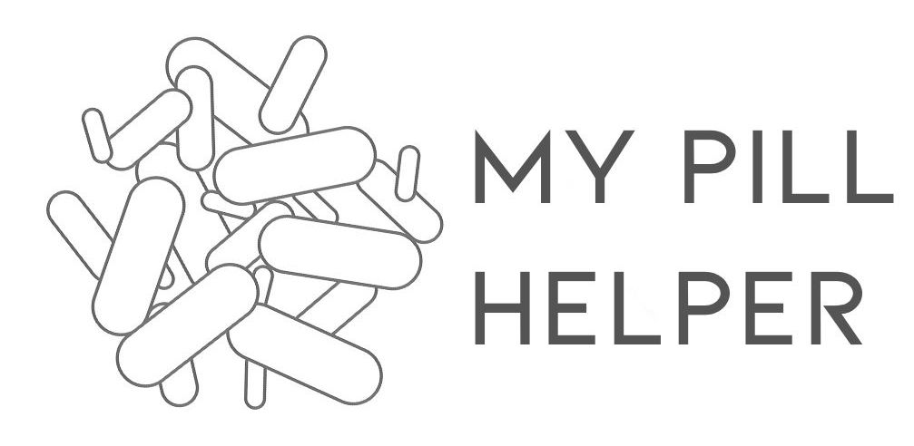
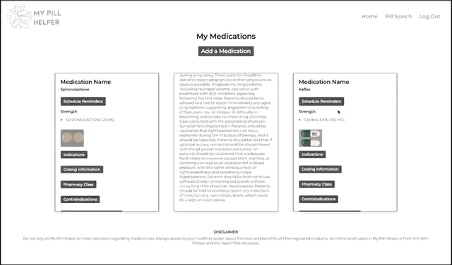
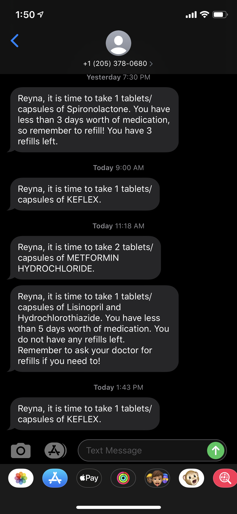
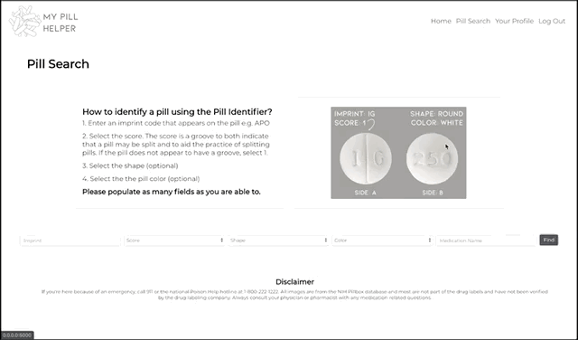

This is an application designed to help users log and keep track of medications. In addition to logging medications, user profiles also display more information about each medicine they are on. My Pill Helper also offers users the option to schedule text reminders. Once users opt-in for scheduling, they will also get updates when it is time to refill their medication. Those who do not wish to create a user profile can use My Pill Helper as a pill identifier or as a tool to remind them of dosing instructions or common indications for a specific drug.

## About the Developer

My Pill Helper was created by Reyna Diaz. She has a background in Human Biology, and this was her first project. Learn more about the developer on [LinkedIn](https://www.linkedin.com/in/reyna-diaz-4589a266/).

## Tech Stack
**Backend:** Python, Flask, PostgreSQL, SQLAlchemy 
**Frontend:** HTML5, CSS, Javascript, AJAX, jQuery, Bootstrap, Jinja2 
**APIs:** Open FDA, Twilio 
**Datasets:** National Institutes of Health (Pillbox)

## Features 

Ever forget your medication list when you get to a new doctor? Log your medications and see more information about each pill you are taking. 


Need a reminder to take your medications? Schedule text reminders!




Text reminders will notify you at your desired time and also give you a heads up when it is time to refill your medication. 




Have you ever organized your medications and forgot which one was which? Search for a pill by its features. Users do not have to register to use the pill search.   


Or perhaps you have medication, and you lost the dosing instructions. Search by medication name. 




## Installation

#### Requirements:

- PostgreSQL
- Python 3.6
- OpenFDA and Twilio API keys

To run this app on your local computer, please follow these steps:

Clone repository:
```
$ git clone https://github.com/ReyBernDia/MyPillHelper.git
```
Create a virtual environment:
```
$ virtualenv env
```
Activate the virtual environment:
```
$ source env/bin/activate
```
Install dependencies:
```
$ pip install -r requirements.txt
```
Create the following secret keys that you get from the [FDA](https://open.fda.gov/apis/authentication/) and [Twilio](https://www.twilio.com/sms):
```
FDA_API_KEY = 'abc'
TWILIO_ACCOUNT_SID = 'def'
TWILIO_AUTH_TOKEN = 'ghi'
TWILIO_NUMBER = 'jkl'
```
Create database 'meds_prod'.
```
$ createdb meds_prod
```
Once you have created an empty database, read the meds_production.sql into like so:
```
$ psql meds_prod < meds_production.sql
```
Run the app from the command line.
```
$ python3 server.py
```

## For Version 2.0

- **More flexible reminders:** Reminder system to account for users with more complex pill regimens (e.g., prednisone tapers)
- **Pharmacy Near Me:** Users to add their pharmacy information so that refill text reminders will come with their nearest pharmacy. 
